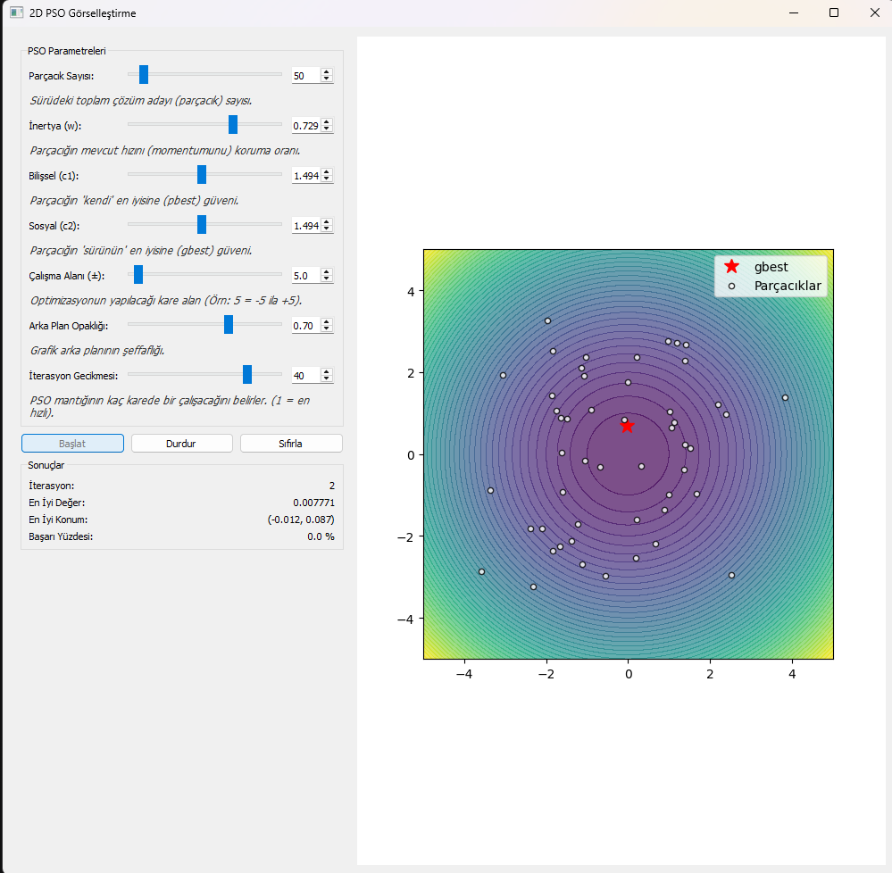

# Parçacık Sürü Optimizasyonu (PSO) Görselleştirme

Bu proje, **Parçacık Sürü Optimizasyonu (Particle Swarm Optimization - PSO)** algoritmasının çalışma mantığını anlamak ve parametrelerin (atalet, bilişsel ve sosyal katsayılar) sürü üzerindeki etkisini gerçek zamanlı olarak gözlemlemek için geliştirilmiş, etkileşimli bir masaüstü uygulamasıdır.

Python, **PyQt5** (arayüz için) ve **Matplotlib** (grafik çizimi için) kütüphaneleri kullanılarak geliştirilmiştir.

Bu simülasyon aracı, PSO algoritmasının temel bileşenlerini değiştirmenize ve sonuçları anlık görmenize olanak tanır:

* **Dinamik Parametre Kontrolü:** Simülasyonu durdurmadan aşağıdaki değerleri değiştirebilirsiniz:
    * **Parçacık Sayısı:** Sürüdeki toplam birey sayısı.
    * **İnertya (w):** Parçacığın mevcut hızını (momentumunu) koruma eğilimi.
    * **Bilişsel Katsayı (c1):** Parçacığın kendi en iyi konumuna (*pbest*) güveni.
    * **Sosyal Katsayı (c2):** Parçacığın sürünün en iyi konumuna (*gbest*) güveni.
    * **Çalışma Alanı:** Optimizasyonun yapılacağı alanın büyüklüğü (Örn: -5 ile +5 arası).
* **Görselleştirme:**
    * **Sphere Fonksiyonu** ($x^2 + y^2$) üzerinde optimizasyon.
    * Parçacıkların (beyaz noktalar) ve Sürü En İyisinin (kırmızı yıldız) canlı takibi.
    * Renkli kontur haritası (Contour Map) üzerinde 2D gösterim.
* **Canlı İstatistikler:**
    * İterasyon sayısı, En iyi uygunluk değeri (Best Value), En iyi konum ve Başarı yüzdesi takibi.
